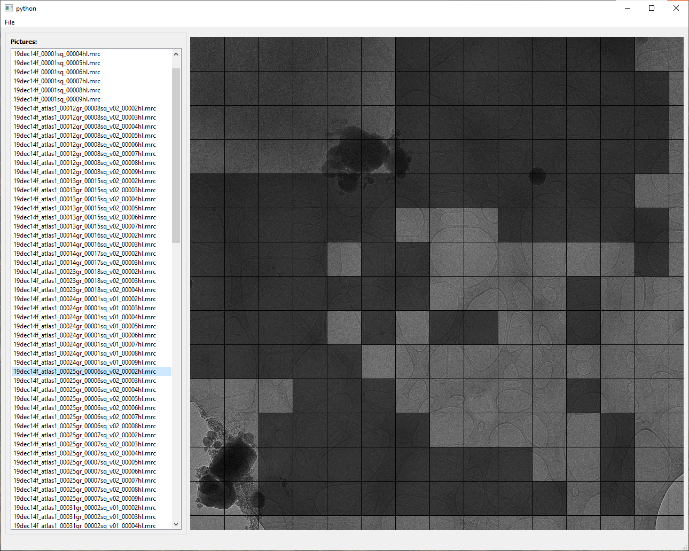
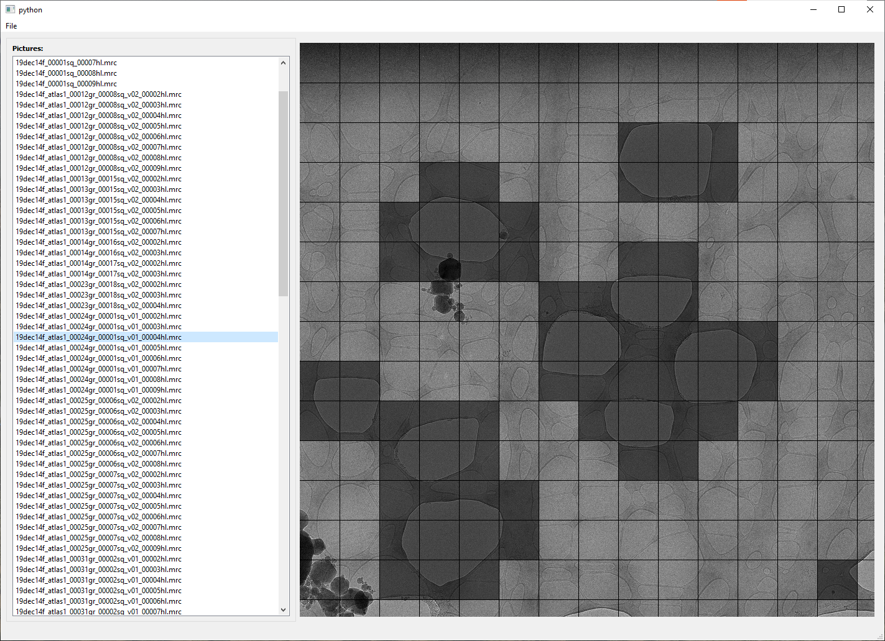

# filfinder
Machine Learning based Filament Finder for Leginon

<!-- TABLE OF CONTENTS -->
<details open="open">
  <summary>Table of Contents</summary>
  <ol>
    <li>
      <a href="#about-the-project">About The Project</a>
      <ul>
        <li><a href="#built-with">Built With</a></li>
      </ul>
    </li>
    <li>
      <a href="#getting-started">Getting Started</a>
    </li>
    <li>
        <a href="#labelling-data">Labelling Data</a>
      <ul>
        <li><a href="#prerequisites-fil-painter">Prerequisites Fil Painter</a></li>
        <li><a href="#using-fil-painter">Using Fil Painter</a></li>
      </ul>
    </li>
    <li>
        <a href="#training-models">Training Models</a>
        <ul>
            <li><a href="prerequisites-training">Prerequisites Training</a></li>
            <li><a href="#autoencoder">Autoencoder</a></li>
            <li><a href="#classifier">Classifier</a></li>
        </ul>
    </li>
    <li><a href="#leginon-plugin">Leginon Plugin</a></li>
    <li><a href="#license">License</a></li>
    <li><a href="#contact">Contact</a></li>
    <li><a href="#acknowledgements">Acknowledgements</a></li>
  </ol>
</details>


<!-- ABOUT THE PROJECT -->
## About The Project

This is a Leginon plugin to help automate data collection on non-uniform samples, primarily filamentous complexes. Specifically, this was designed in mind for collecting data on LRRK2 filaments bound to microtubules using lacey grids rather than the usual UltrAuFoil or Quantifoil grids with equally spaced holes. This plug-in works on the hole level magnification, where it can select multiple imaging areas with filaments, as well as suggest an area to put down a focus target that contains enough carbon to properly focus.

This is the code was used in the "Structural basis for Parkinson’s Disease-linked LRRK2’s binding to microtubules" by Snead DM, Matyszewski M, Dickey AM et al. While it can be adapted to work with other proteins or complexes, I will not be updating this particular repo with such updates. Instead, there will be a suite of tools released in the near future that will contain much more user-friendly tools to train such models and create custom Leginon plugins. I will update this repo with a link when that work is ready for release.

In addition, this plug-in was developed with the Talos Arctica in mind, which means our imaging beam has a fixed diameter and it will burn the sample near the chosen exposure area. To account for this, the plug-in will try to most efficiently choose imaging areas without imaging pre-exposed areas, while maximizing how many images it can take. While I make suggestion on how to modify the code to make it work better on the Titan Krios (which has no such beam size limitations), I was unable to test them.

### Built With

This plug-in is written primarily written in Python 2.7 as that is what Leginon currently uses. For generating the training models, I used Python 3.7, but newer Python should work too. The actual Machine Learning model is made with Tensorflow 2.3. However, the latest Tensorflow supported on Python 2.7 is Tensorflow 2.2, which unfortunately gave me compatibility issues with 2.3 models. Instead, the Leginon computer used Tensorflow 2.1, which was able to use all the models I created in Tensorflow 2.3 without problems.


<!-- GETTING STARTED -->
## Getting Started

This project contains 3 parts:
<ul>
    <li>Labeling data</li>
    <li>Creating the models</li>
    <li>Using the Leginon plug-in</li>
</ul>
Each part uses different scripts and programs, so I will have prerequisites/installation listed for each one.

<!-- Labeling data -->
## Labeling Data
As with most Machine Learning approaches, you will need training data to effectively train your model. Unfortunately, the model I created is not only very specific to my sample, but it's also very sensitive to microscope parameters. While I will include a copy of it, I don't expect it to work for any other samples/microscopes without retraining.

Hence, I am including some of the tools I made to help me create the training data. For labeling data, I created a tool called Fil Painter. It's meant to load up hole magnification images and allows you mark them to create the labels required to do the classification with.

As for how much data you need, it will depend. When training this for the first time, I used about 300 hole images for the autoencoder, but for the classifier, I did not label all of the data, and instead used data augmentation techniques to help me out.

### Prerequisites Fil Painter

This program uses Python 3.7+ with these modules installed:
<ul>
<li>PyQt5</li>
<li>mrcfile</li>
<li>dataset</li>
</ul>
I recommend creating a new conda environment. mrcfile and dataset were installed using pip, and PyQt5 was installed with conda.

### Using Fil Painter
General usage:
<ul>
    <li>If resuming an old project:<br>
    python fil_painter.py</li>
    <li>Starting a new project:<br>
    python fil_painter --db database_name.db</li>
    <li>Manual start:<br>
    python fil_paitner --directory /location/of/files/ --db data_basename</li>
</ul>

I use Fil Painter to create multiple databases that each focus on a single classification feature. As used in the paper, I created 4 classes: filaments (fil), aggregation/dark areas (agg), broken ice (ice), and carbon (carbon).

For each class I create a new database with:

```python fil_painter.py --db database_name.db```

This command will cause Fil Painter to prompt which folder to open and will then create the new database if it doesn't exist, otherwise it will resume a session in that folder. The program only adds entries on the first bootup, so no new files will be added to the database. You will have to do that manually by working with SQL.

Once the program is running, simply click on the locations you want to label. The program will shade them in a darker color. Each change is automatically saved to the database. There's no save button, which also means there is no undo button. You can create copies of the db files if you think you will need to undo something. db files created by Fil Painter will be later opened by the training scripts.

By default, the program is expecting to be looking at 924 by 924 mrc files. If your hole view is different, you will need to adjust the code yourself. Custom setup is not supported in this version.




<!-- ML Models -->
## Training Models
This section will cover how to train models with data. While technically Fil Finder only uses the classifier in the final Leginon plug-in, for best results it's important to train the autoencoder first. 

### Prerequisites Training
Requires Python 3.7+ with these modules installed:
<ul>
    <li>numpy</li>
    <li>matplotlib</li>
    <li>mrcfile</li>
    <li>tensorflow (2.1 or 2.3 recommended for compability with 2.1 used in the actual plug-in)</li>
    <li>scikit-learn</li>
    <li>dataset</li>
</ul>
Once again, I recommend a conda environment. Only mrcfile and dataset need to be installed with pip, the others are personal preference.

Since you are training models, a GPU is recommended, but should work with CPUs as well (just slower). I was training this with a Nvidia 2060 6GB GPU, so strong GPUs are not required to make this work. Keeping the models quick and reasonably sized was one of the core principles of this project.

Training was done on Windows installation, but results should be the same when ran on Linux. Mac should work too, except no Nvidia support.

### Autoencoder

See the <a href="autoencoder.ipynb">Autoencoder notebook</a> for details how to train it. "autoencoder_enFeatures_512b_stdver" is the model as created for the publication.

### Classifier

See the <a href="classifier.ipynb">Classifier notebook</a> for details how to train it. It uses the training data created with Fil Painter and assumes you have trained an autoencoder. The model created here will be used by the Leginon plug-in. "full_model_all_filters_v3" is the model file used for publication.

<!-- Leginon plugin -->
## Leginon Plugin
The Leginon plugin is the <a href="fil_picker.py">Fil Picker</a> file. The current version expects hard coded in configs. Please see the comments in the file if you wish to modify anything. A more customization friendly version will be released as a part of future Machine Learning suite.

### Prerequisites Leginon
This plug-in assumes you have a working version of Leginon installed. We used Leginon 3.4 with the plug-in, but I see no reason why it wouldn't work with anything newer. Even if Leginon changes to Python 3, I don't see many issues arising unless they change the API.

On top of a working Leginon install, you will need a few additional python modules installed:
<ul>
    <li>Tensorflow 2.1 (2.2 is the last version compatible with Python 2.7, and unfortunately has compability issues with models created in different version. I recommend sticking with 2.1 version if using models trained in other versions.)</li>
    <li>scipy</li>
    <li>numpy (some Leginon installs needed an upgrade to work properly, easy to tell if you start receiving numpy errors)</li>
</ul>
Work with your IT department (or whoever maintains Leginon) to determine the best way to install these.

As for running these models, no GPU is necessary. As long as you have decent RAM (16GB+ recommended) there should be no problems running this on top of Leginon. Only tested in Linux based Leginon install.

### Installation
There are two ways to install Leginon plug-ins, and it mostly depends on how many plug-ins you are expecting to run.

<ol>
    <li>Only using one plug-in:</li>
    <ul>
        <li>Simply rename the fil_picker.py file to testtargetfinder.py and add to your Leginon directory. You will have to create a new application that calls TestTargetFinder to use this plugin. Nothing else needs to be updated. (Preferred installation)</li>
    </ul>
    <li>Using multiple plug-ins:</li>
    <ul>
        <li>Leginon does not support drag and drop of multiple plug-ins. See <a href="https://emg.nysbc.org/redmine/projects/leginon/wiki/Creating_a_new_Leginon_node">Creating a new Leginon node</a> for instructions on how to register a new plug-in. No need to create a new data type or gui, as this plug-in is fine re-using the testtargetfinder files.</li>
    </ul>
</ol>
Most of the testing was done with this being the only plug-in installed. The future suite will contain more information on how to run multiple plug-ins at once.

Whichever way you installed the plug-in, you will need to create a new application that uses this plug-in at the hole magnification. I personally copied over the MSI application and replaced the Exposure Targeting node with TestTargetFinder/FilFinder (depending on the install type). You will know it's working when upon starting the application you will see Tensorflow notifications in the terminal. I'm including a sample <a href="MSI-T2-custom.xml">application xml</a> file if more instructions are needed. In particular look for lines with TestTargetFinder and ML Finder names.

### Plugin Instructions
The plug-in is designed to run without user interference, and besides validation, it will do everything automatically. Simply load up an Application configured to use it. If everything is working correctly Fil Finder will simply take over as the Exposure Targeting node. I recommend having user verification on for a few trials to double check the picking. You can manually remove and/or add targets, including the focus target.

As provided, the plug-in will try to maximize the number of exposures with filaments that do not overlap with each other. It also forces the focus target to be on a carbon section, ideally near the center, but number of good exposures is prioritized.

We used this plug-in with the <a href="https://emg.nysbc.org/redmine/projects/leginon/wiki/Lens_Aberration_Correction_Calibration_for_Beam-Image_Shift_Targeting">Lens Aberration Correction Calibration for Beam-Image Shift Targeting</a> on, so all the targets were moved to by image shift rather than stage shift. This allowed us to keep the downtime between images short (1 sec wait). If using stage movement, increase the time accordingly.
<!-- LICENSE -->
## License

Distributed under the Apache Ver 2 License. See `LICENSE` for more information.

Parts of the code present in fil_picker.py are additionally licenced by Leginon. See https://emg.nysbc.org/redmine/projects/leginon for more information.

<!-- ACKNOWLEDGEMENTS -->
## Acknowledgements
* [Leginon Developers for creating Leginon](https://emg.nysbc.org/redmine/projects/leginon)
* [Tensorflow for their tutorials](https://www.tensorflow.org/)
* [othneildrew for his README.md template](https://github.com/othneildrew/Best-README-Template)
